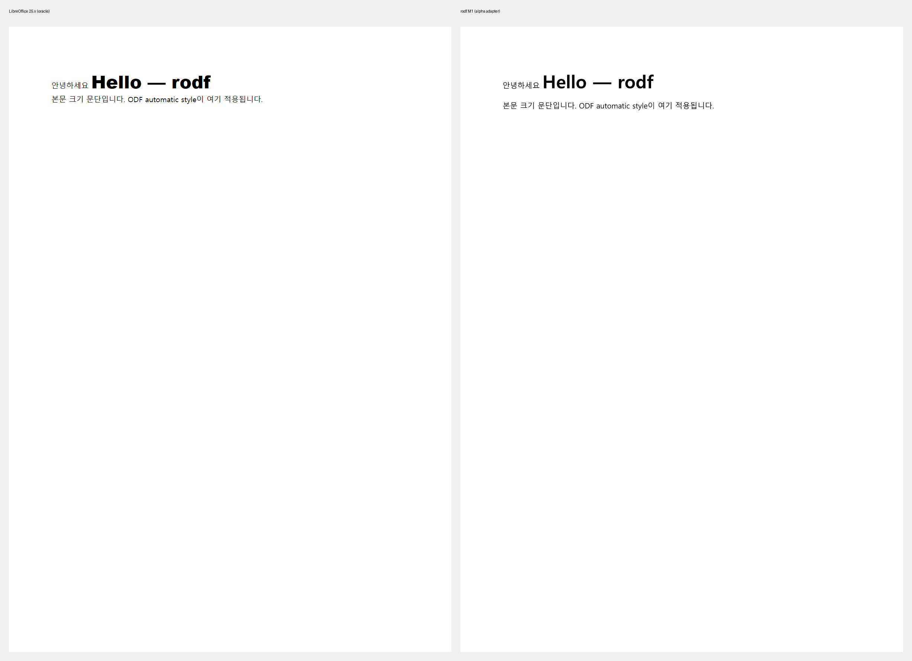

# rodf

**순수 Rust로 만드는 경량 고충실도 ODF(OpenDocument) 렌더링. ODT 우선.**
**Lightweight, high-fidelity ODF (OpenDocument) rendering in pure Rust. ODT first.**

rodf는 Rust 문서 포맷 프로젝트 패밀리의 ODF 구성원입니다:
[rdocx](https://github.com/tensorbee/rdocx) (DOCX 라이브러리 + 레이아웃 엔진),
[rdoc](https://github.com/emptinessform/rdoc) (브라우저 DOCX 뷰어/에디터),
[rhwp](https://github.com/edwardkim/rhwp) (HWP/HWPX 풀스택).

> rodf is the ODF member of a family of Rust document-format projects:
> [rdocx](https://github.com/tensorbee/rdocx) (DOCX library + layout engine),
> [rdoc](https://github.com/emptinessform/rdoc) (browser DOCX viewer/editor), and
> [rhwp](https://github.com/edwardkim/rhwp) (HWP/HWPX full stack).

rodf가 노리는 빈 자리: **LibreOffice를 통째로 싣지 않고 LibreOffice급 ODT 렌더링.**
ZetaOffice는 스위트 전체를 WASM으로 포팅하고(수백 MB), 순수 Rust ODF 크레이트들은
레이아웃 없이 문서 *생성*에 집중합니다. rodf는 그 중간 — ODT를 파싱해 PDF/PNG로
충실하게 렌더하는 작은 라이브러리를 지향하며, **한국어 타이포그래피를 1급
요구사항**으로 둡니다.

> The gap rodf targets: LibreOffice-grade ODT rendering without shipping LibreOffice.
> ZetaOffice ports the whole suite to WASM (hundreds of MB); pure-Rust ODF crates focus
> on document *generation* without layout. rodf aims at the middle — a small library
> that parses ODT and renders it faithfully to PDF/PNG, with **Korean typography as a
> first-class requirement**.

## 현황 / Status: early (M1 진행 중)

텍스트 문서에 대해 `rodf render in.odt out.pdf`가 오늘 동작합니다:

- ODT 패키지 + `content.xml` / `styles.xml` 파싱
- automatic style / named style / default-style 체인 해석 — 서양(`fo:*`)과
  동아시아(`style:*-asian`) 속성을 분리 유지해, 한글·라틴 혼합 텍스트가
  문자 체계별 올바른 크기와 굵기로 렌더됩니다
- master-page 페이지 기하 (페이지 크기, 여백)
- [rdocx](https://github.com/tensorbee/rdocx) 레이아웃 엔진을 통한 렌더링
  (어댑터 방식), PDF·PNG 출력

> `rodf render in.odt out.pdf` works for text documents today: ODT package parsing,
> automatic/named/default style chain resolution with Western (`fo:*`) and East Asian
> (`style:*-asian`) properties kept separate — mixed Korean/Latin text renders at its
> correct per-script size and weight — master-page geometry, and rendering through the
> rdocx layout engine (adapter approach) to PDF and PNG.

LibreOffice(왼쪽) vs rodf(오른쪽), 같은 `hello.odt`:



모든 변경은 **LibreOffice 오라클**로 판정합니다 — `tools/oracle.py`가 같은 문서를
headless LibreOffice로 렌더해, ±2px 정합 후 콘텐츠 크롭 SSIM(blur2 기준 ≥ 0.95)으로
판정합니다. **M1 기준 달성**: hello 픽스처 blur2 **0.983** (raw 0.921), 굴림
lineGap 픽스처 blur2 **0.976** — 한글/라틴 문자체계별 크기·굵기, A4 페이지 기하,
hhea lineGap(행 위 배치)까지 LibreOffice와 정렬된 상태입니다.

> Every change is judged against a **LibreOffice oracle** — `tools/oracle.py` renders
> the same document through headless LibreOffice, registers within ±2px, and scores a
> content-cropped SSIM (pass = blur2 ≥ 0.95). **M1 criterion met**: hello fixture
> blur2 **0.983** (raw 0.921), Gulim lineGap fixture blur2 **0.976** — per-script
> size/weight, A4 page geometry, and hhea lineGap (seated above the line) all align
> with LibreOffice.

## 핵심 방향: MCFS / Key direction: MCFS (Metric-Compatible Font Substitution)

rodf가 시리즈에 가져가려는 대표 기능은 **MCFS — 메트릭 호환 글꼴 대체**입니다. 문서에 사용된
폰트가 시스템에 없어도, 유사한 모양의 폰트를 **원본과 동일한 메트릭**으로 대체해
줄바꿈과 쪽나눔이 흐트러지지 않게 유지합니다 — 한/글의 글꼴 대체 시뮬레이션(FSL)이
증명한 접근을, 사설 방식이 아닌 **국제 표준**(OpenType OS/2의 PANOSE-1,
ISO/IEC 14496-22)으로, 그리고 rodf 전용이 아닌 **ODF·HWP/HWPX·DOC/DOCX 공용
구조**로 구현하는 것이 목표입니다. 세 포맷 모두 폰트 기술자(ODF
`svg:panose-1`, DOCX `fontTable.xml`, HWP FaceName 레코드)를 이미 싣고 다니므로,
공통 매칭·메트릭 시뮬레이션 계층을 시리즈가 공유할 수 있습니다.

> The flagship capability rodf brings to the series is **MCFS — metric-compatible font substitution**: when a
> document's font is missing on the system, substitute a similar-looking font at the
> **original font's metrics**, so line breaks and pagination never shift — the approach
> proven by Hancom Office's font substitution, rebuilt on **international standards**
> (PANOSE-1 in the OpenType OS/2 table, ISO/IEC 14496-22) and shared across
> **ODF, HWP/HWPX, and DOC/DOCX** rather than tied to one format. All three formats
> already carry font descriptors (ODF `svg:panose-1`, DOCX `fontTable.xml`, HWP
> FaceName records), so one matching + metric-simulation layer can serve the whole
> family.

MCFS가 폰트 저작권·EULA·상표와 어떤 관계에 있는지는
[docs/mcfs-licensing.md](docs/mcfs-licensing.md)에 정리되어 있습니다 — 요지: 파일과
외형은 건드리지 않고 숫자 메트릭만 다루므로 저작권·디자인권 문제가 구조적으로
없으며, 잔여 리스크(EULA·이름)는 렌더 기반 측정과 개명 관행으로 완화합니다.

> How MCFS relates to font copyright, EULAs, and trademarks is covered in
> [docs/mcfs-licensing.md](docs/mcfs-licensing.md) — in short: only numeric metrics
> are used (never files or outlines), so copyright/design-right issues are
> structurally absent; residual risks (EULAs, naming) are mitigated by
> render-based measurement and renaming conventions.

관련 선행 오픈소스: [PolarisOffice/polaris_mcfg](https://github.com/PolarisOffice/polaris_mcfg)
(MIT) — 원본 폰트의 숫자 메트릭을 자유 라이선스 폰트에 입혀 대체 폰트를 *생성*하는
도구. mcfg가 오프라인 생성이라면 rodf의 MCFS는 런타임 대체로 상호보완이며,
mcfg의 메트릭 JSON 스펙을 데이터 포맷으로 활용하는 것을 검토 중입니다.

> Related prior art: [PolarisOffice/polaris_mcfg](https://github.com/PolarisOffice/polaris_mcfg)
> (MIT) *generates* metric-compatible substitute fonts offline by applying a source
> font's numeric metrics to a freely-licensed design. rodf's MCFS is the runtime
> counterpart, and adopting mcfg's metric JSON spec as our data format is under
> consideration.

## 크레이트 / Crates

| Crate | 역할 / Role |
|---|---|
| `rodf-core` | ODF 패키지 + 문서 모델 + 스타일 해석 (zip + quick-xml만) / ODF package + document model + style resolution (zip + quick-xml only) |
| `rodf-render` | ODF → 레이아웃 엔진 어댑터, PDF/PNG 출력, 매핑 손실 추적 / ODF → layout-engine adapter, PDF/PNG output, mapping-loss tracking |
| `rodf-cli` | `rodf render in.odt out.{pdf,png}` |

## 로드맵 / Roadmap

- **M1** — 단일 문단 충실도: 파싱 → 렌더 → 오라클 SSIM ≥ 0.95
  / single-paragraph fidelity: parse → render → oracle SSIM ≥ 0.95
- **M1.5** — 오라클 코퍼스(공개 ODT 50–100개) + LibreOffice 버전 고정 Docker CI
  / oracle corpus (50–100 public ODT files) + pinned-LibreOffice Docker CI
- **M2** — 포맷 중립 레이아웃 엔진 작업 (어댑터의 매핑 손실 목록이 계속 어댑터로
  갈지, rodf 전용 플로우 엔진을 만들지 결정)
  / format-neutral layout engine work (the adapter's mapping-loss list decides
  whether rodf keeps adapting or gets its own flow engine)
- **M2.5** — 공개 충실도 대시보드 "Are we ODF yet?" / public fidelity dashboard
- **M3+** — 표, 이미지, 머리글/바닥글, SVG 백엔드, ODS/ODP, WASM/npm
  / tables, images, headers/footers, SVG backend, ODS/ODP, WASM/npm

## 개발 / Development

```sh
cargo test --workspace          # 테스트 18개, 전부 테스트 우선 작성 / 18 tests, all written test-first
cargo run -p rodf-cli -- render crates/rodf-core/tests/fixtures/hello.odt out.pdf
python tools/oracle.py crates/rodf-core/tests/fixtures/hello.odt   # LibreOffice 필요 / needs LibreOffice
```

## 라이선스 / License

MIT OR Apache-2.0
